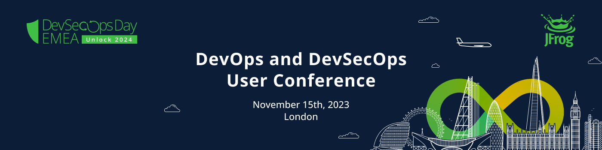

# JFrog’s DevSecOps Day EMEA
### DevOps and DevSecOps teams are required to stay ahead and be prepared for the unexpected challenges coming their way.
With in-person keynotes, breakout sessions, technical workshops and networking with other industry professionals you will gain the practical knowledge and insights you need to be prepared for 2024 challenges.

# Who Should Attend DevSecOps Day EMEA?
Anyone who is a Developer, DevOps Engineer, Security Professional or a DevOps / IT Leader who is interested in DevOps or DevSecOps. This is a full day event for customers and prospects that demonstrates  all use cases and challenges that JFrog can enable you to solve.

# Training
Whether you’re just starting out, have some experience, or are an advanced user of JFrog products, our training program offers the opportunity to enhance your understanding of JFrog Artifactory, Security, and other key aspects. Our expert instructors will guide you in elevating your organization’s software supply chain to new heights.
